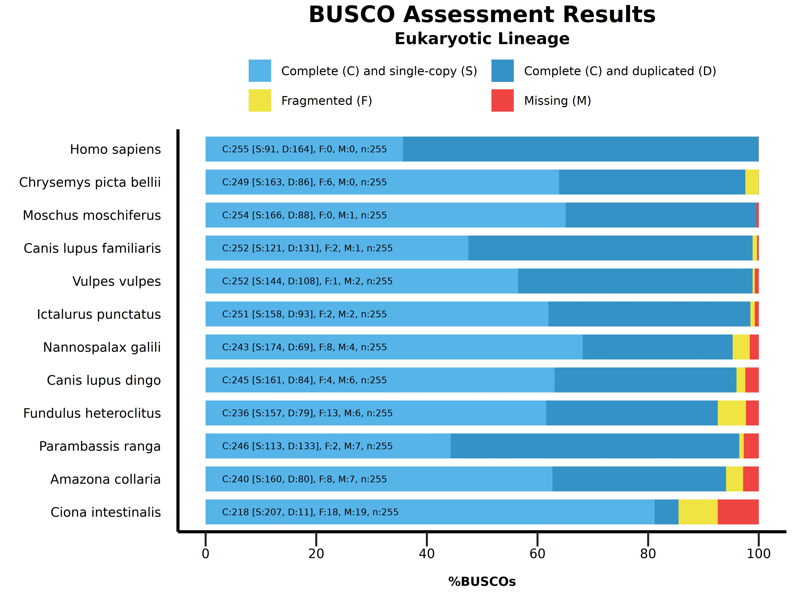
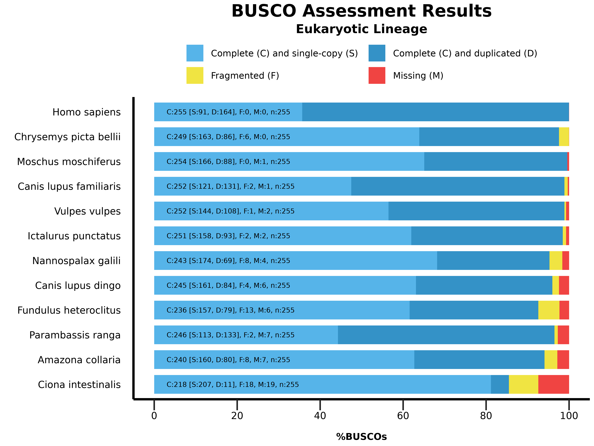
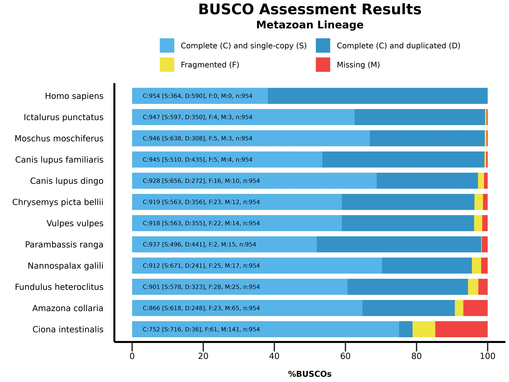

# **Busco_Plot**

## **Test Data**

In total, we are including 24 short summary generic files calculated by BUSCO for either
the eukaryotic or the Metazoan lineages, for the proteomes of:

*`Amazona collaria`*

*`Canis lupus dingo`*

*`Canis lupus familiaris`*

*`Chrysemys picta bellii`*

*`Ciona intestinalis`*

*`Fundulus heteroclitus`*

*`Homo sapiens`*

*`Ictalurus punctatus`*

*`Moschus moschiferus`*

*`Nannospalax galili`*

*`Parambassis ranga`*

*`Vulpes vulpes`*


The files corresponding to the _Eukaryotic_ lineage are located in the **`01_Eukaryotic_Summaries`** directory.

Their name are:

```
short_summary.generic.eukaryota_odb10.Amazona collaria.txt
short_summary.generic.eukaryota_odb10.Canis lupus dingo.txt
short_summary.generic.eukaryota_odb10.Canis lupus familiaris.txt
short_summary.generic.eukaryota_odb10.Chrysemys picta bellii.txt
short_summary.generic.eukaryota_odb10.Ciona intestinalis.txt
short_summary.generic.eukaryota_odb10.Fundulus heteroclitus.txt
short_summary.generic.eukaryota_odb10.Homo sapiens.txt
short_summary.generic.eukaryota_odb10.Ictalurus punctatus.txt
short_summary.generic.eukaryota_odb10.Moschus moschiferus.txt
short_summary.generic.eukaryota_odb10.Nannospalax galili.txt
short_summary.generic.eukaryota_odb10.Parambassis ranga.txt
short_summary.generic.eukaryota_odb10.Vulpes vulpes.txt
```

The files corresponding to the _Metazoan_ lineage are located in the **`02_Metazoan_Summaries`** directory.

Their name are:

```
short_summary.generic.metazoa_odb10.Amazona collaria.txt
short_summary.generic.metazoa_odb10.Canis lupus dingo.txt
short_summary.generic.metazoa_odb10.Canis lupus familiaris.txt
short_summary.generic.metazoa_odb10.Chrysemys picta bellii.txt
short_summary.generic.metazoa_odb10.Ciona intestinalis.txt
short_summary.generic.metazoa_odb10.Fundulus heteroclitus.txt
short_summary.generic.metazoa_odb10.Homo sapiens.txt
short_summary.generic.metazoa_odb10.Ictalurus punctatus.txt
short_summary.generic.metazoa_odb10.Moschus moschiferus.txt
short_summary.generic.metazoa_odb10.Nannospalax galili.txt
short_summary.generic.metazoa_odb10.Parambassis ranga.txt
short_summary.generic.metazoa_odb10.Vulpes vulpes.txt
```

## **Commands**

### **Example_01**

Issuing a command in the **`Test_Data/01_Eukaryotic_Summaries`** directory:

```
python3 ../../Busco_Plot.v1.0.0.py -wd .
```

Would produce three files:

+ The **`Busco_Plot_Figure.R`** file containing the R code that generated the figure.
+ The resulting **`Busco_Plot_Figure.jpeg` `jpeg`** figure file.
+ The resulting **`Busco_Plot_pid.log`** log file.

Note that we did not specify the **`'Eukaryotic Lineage'`** lineage because this lineage is the default lineage of the script.
Also note that this command would produce a file in the **`jpeg`** default file format.

This command should produce the following figure:




### **Example_02**

Alternatively, we could have issued, in the same directory, the following command:

```
python3 ../../Busco_Plot.v1.0.0.py -wd . -l 'Eukaryotic Lineage' -f png
```

This command would will overwrite the already present **`Busco_Plot_Figure.R`** file.
It will also print a new **`log`** file, and generate a new figure file labelled **`Eukaryotic Lineage`**_in **`png`** format.

This command should produce the following figure:



### **Example_03**

Similarly, issuing a command in the **`Test_Data/02_Metazoan_Summaries`** directory:

```
python3 ../../Busco_Plot.v1.0.0.py -wd . -l 'Metazoan Lineage'
```

Would produce three files:

+ The **`Busco_Plot_Figure.R`** file containing the R code that generated the figure.
+ The resulting **`Busco_Plot_Figure.jpeg jpeg`** figure file.
+ The resulting **`Busco_Plot_pid.log`** log file.

Note that, in this case, we must specify the **`'Metazoan Lineage'`** lineage because the default lineage for the script is **`'Eukaryotic'`**.
Also note that this command would produce a file in the **`jpeg`** default file format.

This command should produce the following figure:


